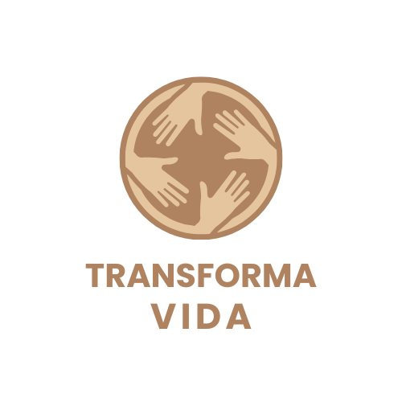

# Projeto Site da ONG "Transforma Vidas" (Projeto Acadêmico)



Bem-vindo ao repositório do site da **Transforma Vidas**. **Este é um projeto acadêmico desenvolvido como parte de um trabalho universitário. A ONG "Transforma Vidas" é uma entidade fictícia, criada exclusivamente para os fins deste projeto.**

O objetivo foi construir uma aplicação web estática que sirva como a principal plataforma de comunicação de uma organização não governamental, demonstrando habilidades em desenvolvimento front-end.

## 📜 Sobre o Projeto

O site "Transforma Vidas" foi criado para simular a presença online de uma ONG, apresentando sua missão, valores e atividades. Ele serve como um portal central para que visitantes, voluntários e doadores possam conhecer mais sobre o trabalho da organização, se envolver em suas causas e acompanhar a transparência de suas ações.

**Como um projeto de estudo, o foco principal foi aplicar conceitos de HTML semântico para criar uma estrutura de site bem organizada, intuitiva e acessível.**

## ✨ Funcionalidades Principais

O site é composto por diversas páginas, cada uma com um objetivo específico:

*   **Início (`index.html`):** Página principal com uma mensagem de boas-vindas e a missão da ONG.
*   **Sobre (`sobre.html`):** Apresenta a história, a equipe e os valores da Transforma Vidas.
*   **Projetos (`projetos.html`):** Detalha os projetos sociais em andamento e já concluídos.
*   **Voluntariado (`voluntariado.html`):** Oferece informações sobre como se tornar um voluntário.
*   **Doações (`doacoes.html`):** Guia os usuários sobre como podem contribuir financeiramente.
*   **Transparência (`transparencia.html`):** Apresenta relatórios financeiros e de impacto social.
*   **Contato (`contato.html`):** Disponibiliza formas de entrar em contato com a organização.
*   **Blog (`blog.html`):** Compartilha notícias, artigos e histórias de impacto.

## 🛠️ Tecnologias Utilizadas

Este projeto foi construído utilizando tecnologias web fundamentais:

*   **HTML5:** Para a estruturação semântica do conteúdo e a base de todas as páginas.

## 🚀 Como Executar o Projeto

Para visualizar o site, não é necessário nenhum servidor ou instalação complexa. Basta seguir os passos abaixo:

1.  Clone este repositório para sua máquina local:
    ```bash
    git clone https://github.com/seu-usuario/nome-do-repositorio.git
    ```
2.  Navegue até a pasta do projeto:
    ```bash
    cd nome-do-repositorio
    ```
3.  Abra o arquivo `index.html` diretamente no seu navegador de preferência (Google Chrome, Firefox, etc. ).

Pronto! O site estará funcionando localmente.

## 🖼️ Estrutura de Arquivos

O projeto está organizado da seguinte forma:

```
/
├── index.html
├── sobre.html
├── projetos.html
├── voluntariado.html
├── doacoes.html
├── transparencia.html
├── contato.html
├── blog.html
└── img/
    └── logo.png
```

## 🤝 Contribuições

Este é um projeto de estudo, mas contribuições são bem-vindas! Se você tiver sugestões para melhorar o código ou adicionar novas funcionalidades, sinta-se à vontade para abrir uma *issue* ou enviar um *pull request*.

## 📄 Licença

Este projeto é de código aberto e pode ser utilizado livremente para fins de aprendizado.

---
**© 2025 Transforma Vidas (Projeto Fictício)**
